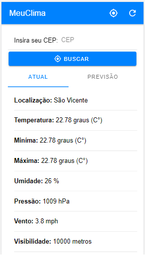
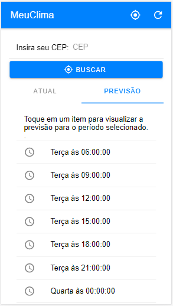
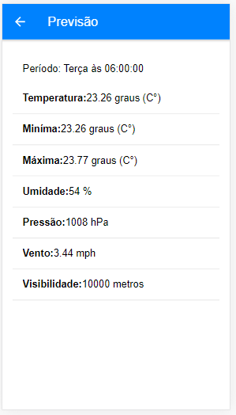

# Aplicação de Clima - Ionic 4

por Rai Nascimento

## Introdução

O aplicativo usa o serviço [Open Weather Map] (http://openweathermap.org/) para fornecer as condições climáticas atuais e uma previsão de 5 dias; você precisará atualizar o arquivo `src / app / config.ts` do projeto com sua chave de API para executar o aplicativo. O arquivo existente se parece com o seguinte:

```TypeScript
export const Config = {
    weatherEndpoint: 'https://api.openweathermap.org/data/2.5/',
    weatherKey: ''
}
```

Preencha a propriedade `weatherKey` com sua chave API Open Weather Map e salve as alterações no arquivo.

## Operação do aplicativo

Na inicialização, o aplicativo usa o plug-in Apache Cordova Geolocation para determinar a localização atual do dispositivo que executa o aplicativo e, em seguida, carrega as condições meteorológicas para esse local. A interface do usuário principal do aplicativo é dividida usando um segmento iônico (controle de `íon-segmento`); o segmento ** Atual ** mostra as condições meteorológicas atuais, enquanto o segmento ** Previsão ** lista a previsão de 5 dias para o local. Toque no ícone de atualização no canto superior direito da IU do aplicativo para atualizar os dados meteorológicos para a localização atual.

Quando um usuário insere um código postal dos EUA, o aplicativo recupera as condições meteorológicas atuais para o local especificado.

> **Note:** Você pode converter facilmente o aplicativo para usar o nome da cidade em vez do código postal. Exige apenas a alteração do URL do endpoint para o serviço meteorológico. 

A figura a seguir mostra o conteúdo do segmento Atual.



Ao fornecer uma previsão, a API Open Weather retorna uma matriz que representa os períodos de previsão que começam no dia seguinte à meia-noite (hora local). O segmento **Previsão** exibe uma lista interativa dos períodos de previsão disponíveis, conforme mostrado na figura a seguir:



Toque em um período para abrir uma página contendo a previsão do tempo detalhada para o período selecionado, conforme mostrado na figura a seguir.


